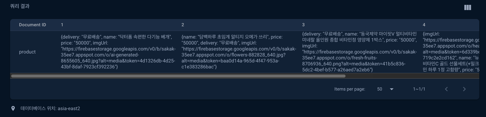

# sakak

## 알고리즘

[풀이 링크](https://alabaster-caravel-721.notion.site/1-71cb82b8685744d2838f3f911c9b6765?pvs=4)

## Cloud Firestore 설정



## 시작하기

클론:

```
git clone https://github.com/androidsdreamofelectricsheep/sakak.git
```

설치:

```
$ cd sakak
$ flutter pub get
```

앱 실행:

```
$ flutter run
```
